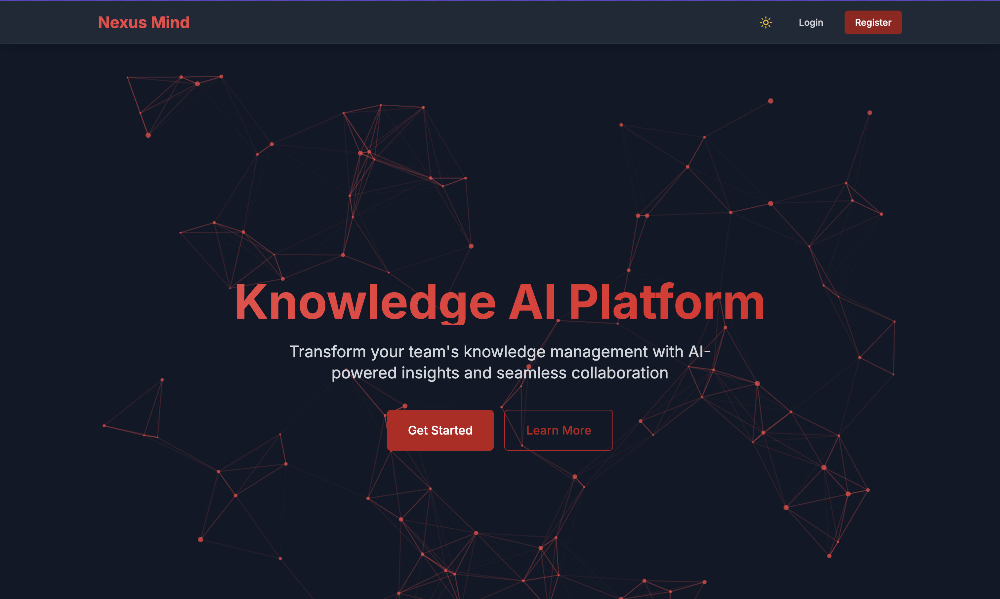
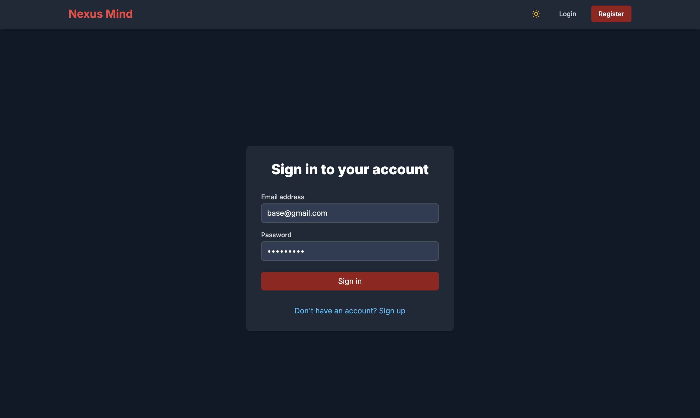
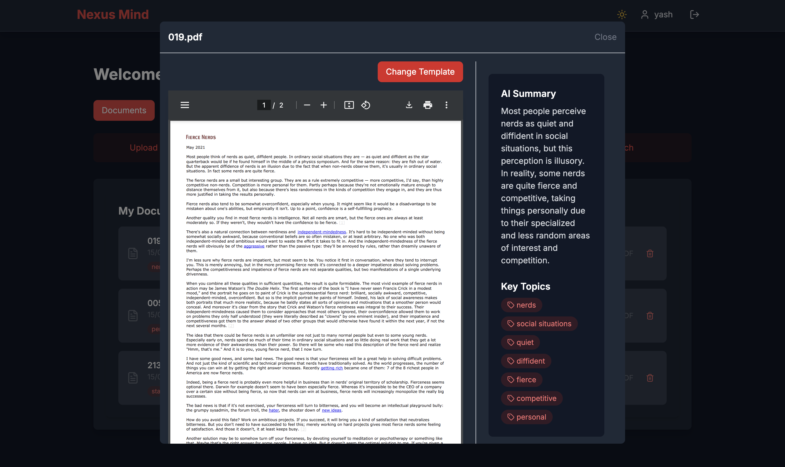
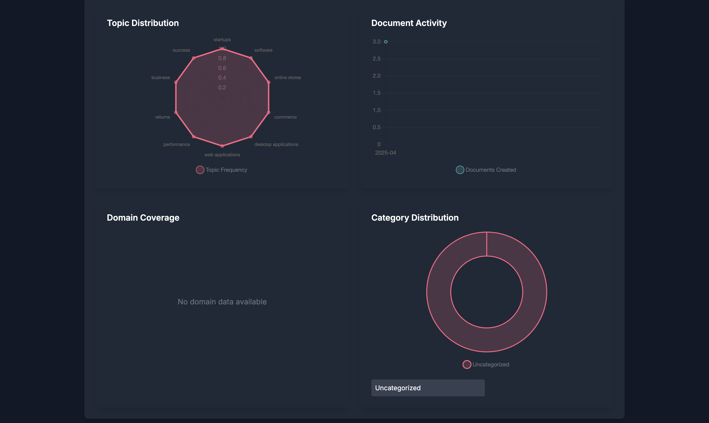
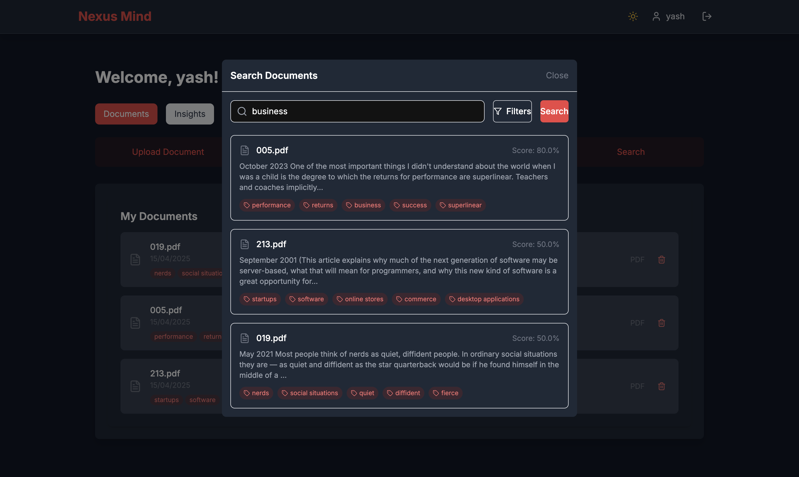
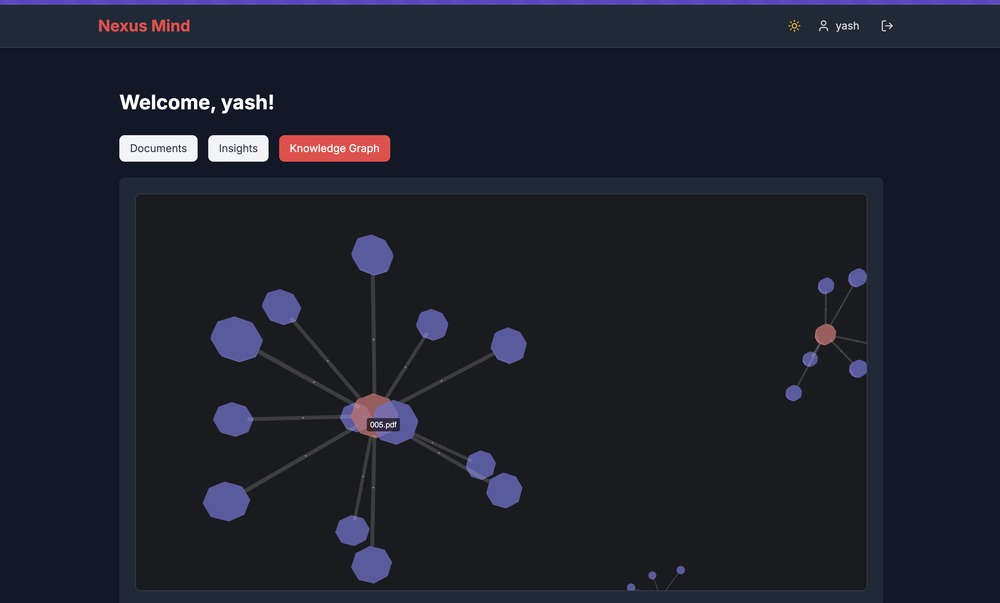
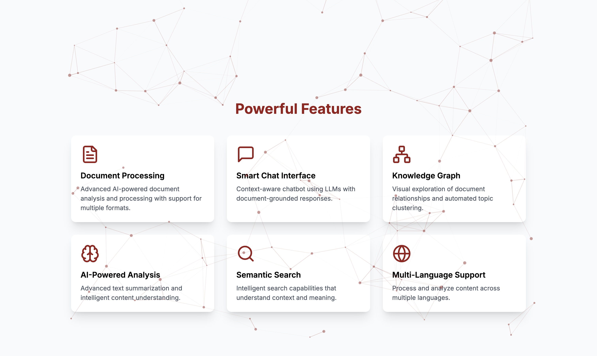

# Knowledge AI Platform - Frontend

A modern AI-powered knowledge management platform built with Next.js 14, helping teams organize, search, and generate insights from their documents and conversations.



## Features

- 🔐 **Authentication System**: Secure user authentication and authorization



- 📄 **Document Management**: Upload, view, and manage multiple document formats



- 🤖 **AI-Powered Analysis**: Smart document processing and insights generation




- 🔍 **Semantic Search**: Context-aware document search capabilities



- 🌐 **Knowledge Graph**: Visual exploration of document relationships




- 🎨 **Dark/Light Mode**: Full theme support with smooth transitions




## Tech Stack

- **Framework**: Next.js 14 with App Router
- **Language**: TypeScript
- **Styling**: Tailwind CSS
- **UI Components**: Shadcn/UI
- **State Management**: React Query
- **Visualization**: D3.js
- **HTTP Client**: Axios
- **Animation**: Framer Motion

## Prerequisites

- Node.js 18+ 
- npm/yarn/pnpm

## Getting Started

1. Clone the repository:
```bash
git clone [your-repo-url]
cd frontend
```

2. Install dependencies:
```bash
npm install
# or
yarn install
# or
pnpm install
```

3. Set up environment variables:
Create a `.env.local` file:
```env
NEXT_PUBLIC_API_URL=http://localhost:8080
```

4. Run the development server:
```bash
npm run dev
# or
yarn dev
# or
pnpm dev
```

5. Open [http://localhost:3000](http://localhost:3000) with your browser.

## Project Structure

This project uses [`next/font`](https://nextjs.org/docs/app/building-your-application/optimizing/fonts) to automatically optimize and load [Geist](https://vercel.com/font), a new font family for Vercel.

## Learn More

To learn more about Next.js, take a look at the following resources:

- [Next.js Documentation](https://nextjs.org/docs) - learn about Next.js features and API.
- [Learn Next.js](https://nextjs.org/learn) - an interactive Next.js tutorial.

You can check out [the Next.js GitHub repository](https://github.com/vercel/next.js) - your feedback and contributions are welcome!

## Deploy on Vercel

The easiest way to deploy your Next.js app is to use the [Vercel Platform](https://vercel.com/new?utm_medium=default-template&filter=next.js&utm_source=create-next-app&utm_campaign=create-next-app-readme) from the creators of Next.js.

Check out our [Next.js deployment documentation](https://nextjs.org/docs/app/building-your-application/deploying) for more details.
